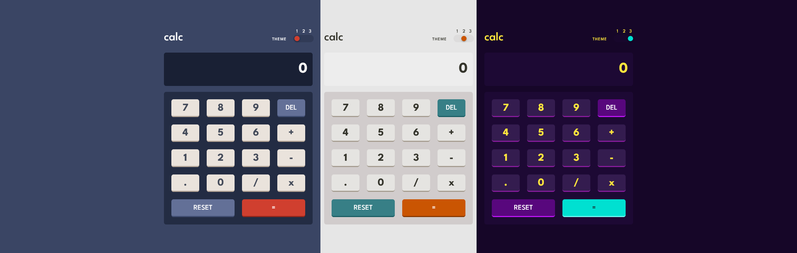

# Calc - Calculator app

This is a solution to the [Calculator app challenge on Frontend Mentor](https://www.frontendmentor.io/challenges/calculator-app-9lteq5N29).

## Table of contents

- [Overview](#overview)
  - [The challenge](#the-challenge)
  - [Screenshot](#screenshot)
  - [Links](#links)
- [Built with](#built-with)
- [Author](#author)

## Overview

### The challenge

Users are able to:

- See the size of the elements adjust based on their device's screen size
- Perform mathmatical operations like addition, subtraction, multiplication, and division
- Adjust the color theme based on their preference and memorise their choice

### Screenshot

### Links

- [Solution URL](https://www.frontendmentor.io/solutions/calculator-app-with-react-BkujtGxIc)
- [Live Site URL](https://dyios.github.io/calculator-app/)

## Built with

- Semantic HTML5 markup
- Flexbox
- [React](https://reactjs.org/) - JS library
- [MUI](https://mui.com/) - Components library

## Author

- Website - [TOLBA Rafik](https://r-tolba.netlify.app/)
- Frontend Mentor - [@Dyios](https://www.frontendmentor.io/profile/Dyios)
